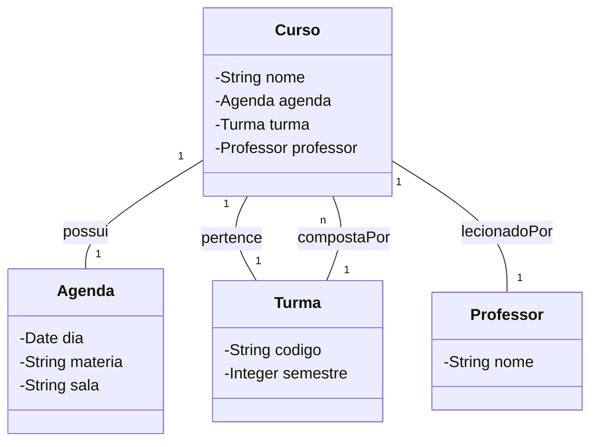

```mermaid
classDiagram
    class Curso {
        -String nome
        -Agenda agenda
        -Turma turma
        -Professor professor
    }

    class Agenda {
        -Date dia
        -String materia
        -String sala
    }

    class Professor {
        -String nome
    }

    class Turma {
        -String codigo
        -Integer semestre
    }

    Curso "1" -- "1" Agenda : possui
    Curso "1" -- "1" Turma : pertence
    Curso "1" -- "1" Professor : lecionadoPor
    Turma "1" -- "n" Curso : compostaPor
```
